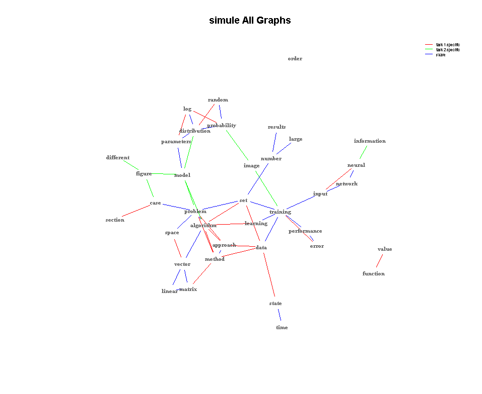
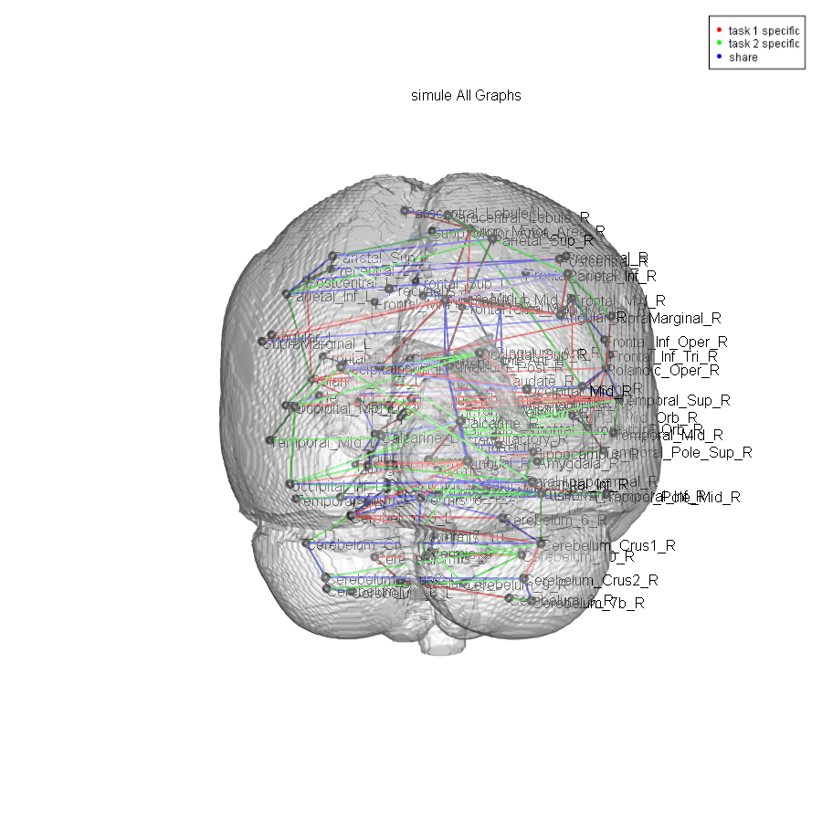
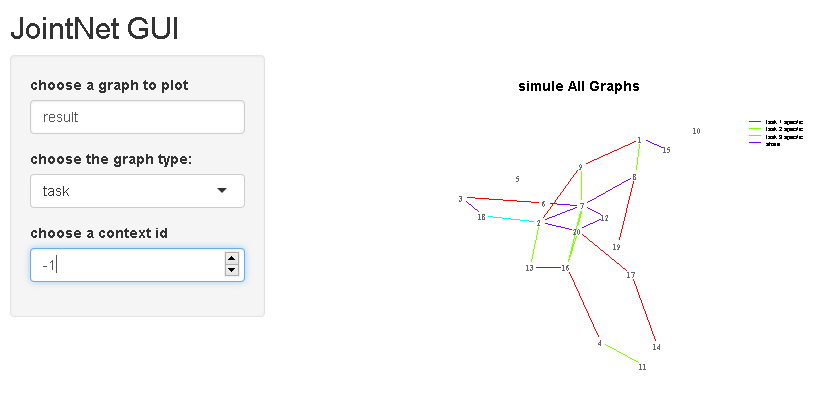

# JointNets

[JointNets](https://github.com/QData/JointNets) is an end-to-end R package for sparse high-dimensional Gaussian graphical model estimation, visualization, simulation and evaluation.

It contains the following estimators:
[SIMULE](https://link.springer.com/article/10.1007%2Fs10994-017-5635-7),
[WSIMULE](https://arxiv.org/abs/1709.04090),
[FASJEM](https://arxiv.org/abs/1702.02715),
[JEEK](https://arxiv.org/abs/1806.00548),
[DIFFEE](https://arxiv.org/abs/1710.11223)
and
DIFFEEK.


Table of Contents
====

- [Installation](#installation)
- [Usage](#Usage)
    - [Estimation](#Estimation)
        - [Methods](#Methods)
        - [Dataset](#Dataset)
        - [Joint Estimation](#Joint-Estimation)
        - [Difference Estimation](#Difference-Estimation)
    - [Visualization](#Visualization)
        - [plot](#plot)
        - [plotbrain](#plotbrain)
        - [Demo](#Demo)
        - [Sample plots](#Sample-plots)
    - [Simulation and Evaluation](#Simulation-and-Evaluation)
        - [Simulation](#Simulation)
        - [Evaluation](#Evaluation)
            - [F1](#F1)      
            - [BIC](#BIC)   
            - [AUC](#AUC)
            - [Demo](#Demo)
    - [GUI](#GUI)
- [License](#License)
- [Getting Help](#Getting-Help)

# Installation
1. From CRAN
    ``` r
    install.packages('JointNets', dependencies=TRUE)
    library(JointNets)
    ```

2. From the GitHub repo. You need to first install the [devtools](https://CRAN.R-project.org/package=devtools) package

    ``` r
    install.packages("devtools")
    ```

    Load the devtools package

    ``` r
    library(devtools)
    ```

    Install from Github

    ``` r
    install_github('QData/JointNets', dependencies = TRUE)
    library(JointNets)
    ```

# Usage

## Estimation
### Methods
JointNets currently support six estimators: [simule](https://link.springer.com/article/10.1007%2Fs10994-017-5635-7),
[wsimule](https://arxiv.org/abs/1709.04090),
[fasjem](https://arxiv.org/abs/1702.02715),
[jeek](https://arxiv.org/abs/1806.00548),
[diffee](https://arxiv.org/abs/1710.11223)
and diffeek
and they serve different estimation purposes:

* joint estimation from multiple contexts:
    * ```simule``` and ```fasjem```
* joint estimation from multiple contexts, incorporating prior knowledge:
    * ```wsimule``` and ```jeek```
* difference estimation from two contexts:
    * ```diffee```
* difference estimation from two contexts, incorporating prior knowledge:
    * ```diffeek```

### Dataset
Each estimator function takes input as a list of data matrices (for multiple contexts) or two separate data matrices (for difference estimation).

The data matrix should be arranged so that each row represents a cell of data (eg, matrix of size 500 x 20 represents 500 instances of data of dimensionality 20).

JointNets comes with a couple of synthetic and real-world datasets for demonstration purposes.

To load them, please run:
``` r
data(exampleData)                ## 2 contexts, dimensionality 100
data(cancer)                     ## 2 contexts, dimensionality 26
data(nip_37_data)                ## 2 contexts, dimensionality 37
data(ABIDE_aal116_timeseries)    ## 2 contexts, dimensionality 116
```
### Joint Estimation
```simule```, ```fasjem```, ```wsimule``` and ```jeek``` are intended for joint estimation from **multiple** contexts.

Take ```simule``` as an example.

First load a dataset:
``` r
data(nip_37_data)
```

Then simply run the function ```simule```:
``` r
result = simule(
  X = nip_37_data,
  lambda = 0.13,
  epsilon = 0.5,
  covType = "kendall",
  parallel = TRUE
)
```

The estimator ```simule``` will return to ```result``` a ```list``` of named elements:
* ```result$graphs```
  * a ```list``` of graphs for each context (in the format of covariance/correlation matrices)
  * In this example, ```result$graphs``` is a list of two matrices of size 37x37
* ```result$share```
  * shared graph (in the format of covariance/correlation matrices) among multiple contexts
  * In this example, ```result$share``` is a matrix of size 37x37
  * ```$share``` is ```NULL``` for ```jeek``` and ```fasjem``` (They do not explicitly estimate for shared graph among contexts. For more details please read [FASJEM](https://arxiv.org/abs/1702.02715) and[JEEK](https://arxiv.org/abs/1806.00548))

To learn about the parameters for each estimator, please try run ```?``` followed by the estimator name in the R console:
``` r
?simule
?wsimule
?jeek
?fasjem
```

### Difference Estimation
`diffee` and `diffeek` are intended for difference estimation from **two** contexts.

Take `diffee` as an example.

First load a dataset:
``` r
data(nip_37_data)
```

Then simply run the function ```diffee```:
``` r
result = diffee(C = nip_37_data[[1]], D = nip_37_data[[2]] , lambda = 0.0035))
```

The estimator ```diffee``` will return to ```result``` a ```list``` of named elements:
* ```result$graphs```
  * a ```list``` of the difference graph between two contexts (in the format of covariance/correlation matrix)
  * In this example, ```result$graphs``` is a list of a **single** matrix of size 37x37
* ```result$share```
  * `NULL`
  * Difference estimation doesn't produce shared graph among contexts. For more details please read [diffee](https://arxiv.org/abs/1710.11223)

To learn about the parameters for each estimator, please run ```?``` followed by the estimator name in the R console:
``` r
?diffee
?diffeek
```


## Visualization
JointNets provides a general purpose ```plot``` function as well as a specialized ```plotbrain``` for 3d brain graph visualization.

`plot` and `plotbrain` are intended for results produced by any of the JointNets estimators.

### plot
Take the result from `simule` estimator as an example.

First, produce a graph estimation:
``` r
data(nip_37_data)
result = simule(
  X = nip_37_data,
  lambda = 0.13,
  epsilon = 0.5,
  covType = "kendall",
  parallel = TRUE
)
```

Then simply run `plot` on `result`. It will plot all graphs from the joint estimation with a descriptive title as well as color legend to distinguish between different contents/tasks.
``` r
plot(result)
```


`plot` extends `plot.igraph` from the [igraph](https://CRAN.R-project.org/package=igraph) package
and there are a lot of options to view and manipulate the graph visualization.

For example:
``` r
graph = returngraph(result)                                       ## get the graph from result
layout = layout_nicely(graph, dim = 2)                            ## produce a layout from graph

## plot task specific graph from context 1 using layout
plot(result, type = "taskspecific", subID = 1, layout = layout)

nodeid = which(label %in% c("data", "probability"))               ## obtain node id for data and probability

## Zoom into the plot at nodes data and probability using the same layout
plot(result, type = "neighbour", index = nodeid, layout = layout)
```

Since estimators in JointNets produce two types of estimation (difference and multiple), plot takes in slightly different parameters for each estimation.

For more details on the parameters in `plot`, please run ```?plot.``` followed by the estimator name in the R console.

For example:
``` r
?plot.simule
```

### plotbrain
`plorbrain` is similar to `plot` but instead plots graph in 3d with a brain background as reference.

Please try `demo(brain)` or `?plotbrain.` followed by the estimator name to learn the function.

### Demo
JointNets provides demos for various estimators and visualization options.

Please try `demo()` with the estimator name. (eg, `demo(simule)`)


### Sample plots



## Simulation and Evaluation
JointNets offers both a simulation and evaluation module for users to produce synthetic graphs and datasets and evaluate the effectiveness of the estimators based on the simulated ground truth.

### Simulation
Simulating sparse Gaussian graphical models (in the format of covariance/correlation matrix) as well as generating samples from the same graphical models are encapsulated in a single function `simulation`.

To simulate **3** related sparse Gaussian graphical models of dimensionality **20** and at the same time generate **100** slices of samples for each context:
``` r
## s and ss control sparsity of all graphs and shared graph, respectively
simulationresult = simulation(p = 20, n=c(100,100,100), seedNum = 37, s = 0.1, ss = 0.1)
```
The function ```simulation``` will return to ```simulationresult``` a ```list``` of named elements:
* ```$simulatedgraphs```
  * a ```list``` of named elements `$graphs` and `$share`
    * `$graphs` is a list of simulated graphs (in the format of covariance and correlation matrices)
    * `$share` is the shared graph among all contexts
* ```$simulatedsamples```
  * a `list` of data matrices

To access graphs and samples from `simulationresult`:
``` r
simulationresult$simulatedgraphs$graphs   ## access graphs
simulationresult$simulatedgraphs$share    ## access shared graph
simulationresult$simulatedsamples         ## access generated samples
```
### Evaluation
JointNets offers three score-based metrics for graphical model estimation evaluation: `F1`, `BIC` and `AUC`.
#### F1
To calculate F1 score from the estimation result obtained by `simule` and the ground truth:
``` r
truth = simulationresult$simulatedgraphs
result = simule(simulationresult$simulatedsamples, 0.2, 0.5, covType = "cov", TRUE)
F1(result,truth)
```
`F1` returns a list of scores for each graph and shared graph (if applicable).

#### BIC
To obtain BIC score from the estimation result obtained by `simule` and the simulated samples:

``` r
BIC(simulationresult$simulatedsamples,result)
```

`BIC` returns a single score for the entire estimation (currently not support for difference estimation)

#### AUC
To compute AUC score for a sequence of estimations with varying lambdas:

``` r
AUC_result = AUC(simulationresult, gm_method = "simule", lambdas = seq(0.1,2,0.05), epsilon = 1)
AUC_result$auc
```
`AUC` returns a list of named elements:
* `$auc`: AUC score for the sequence of estimation
* `$fPM`: A list of False Positive Rates for each estimation
* `$tPM`: A list of True Positive Rates for each estimation

It is also possible to plot the ROC curve from `AUC_result`:

``` r
plot(AUC_result$fPM,AUC_result$tPM, xlab = "False Positive Rate", ylab = "True Positive Rate", main = "ROC")
lines(AUC_result$fPM[order(AUC_result$fPM)], AUC_result$tPM[order(AUC_result$fPM)], xlim=range(AUC_result$fPM), ylim=range(AUC_result$tPM))
```


### Demo
For information on using different scores functions, please try one the following:
``` r
?F1
?BIC
?AUC
```
For more details on simulation and evaluation for various estimators in JointNets, please try:
``` r
demo(evaluation)
```
## GUI
JointNets also offers a simple GUI built in shiny for easy graph exploration.

To invoke the GUI:
``` r
plot_gui()
```


For more details on how to use `plot_gui`, please try:
``` r
?plot_gui
```

# License
GNU GPL version 2

# Getting Help
For bug reports, requests and help, please contact zw4dn@virginia.edu.

You can also [open an issue](https://github.com/QData/JointNets/issues) here on GitHub.
